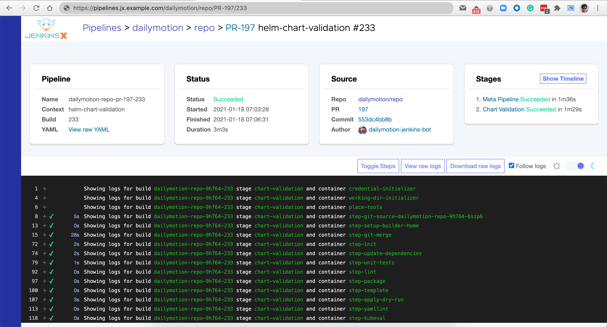
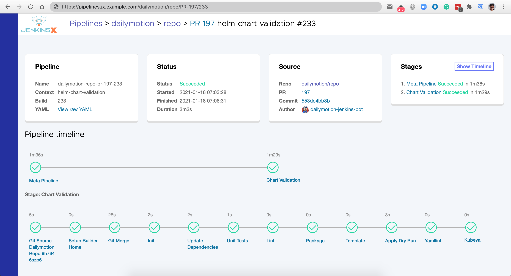
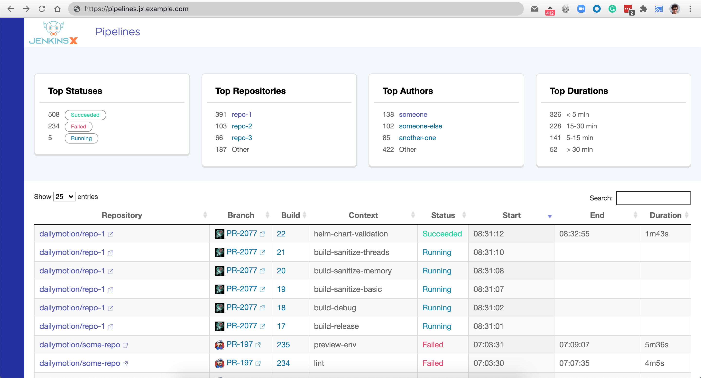

# Jenkins X Pipelines Visualizer

This is a Web UI for [Jenkins X](https://jenkins-x.io/), with a clear goal: **visualize the pipelines - and their logs**.



## Features

- View the pipelines information: metadata, status, stages and steps with timing
- View the pipelines logs in real-time
- Retrieve the archived pipelines logs from the long-term storage (GCS, S3, ...)
- View all pipelines with their status, and filter/sort them
- Read-only: only requires READ permissions on the Jenkins X and Tekton Pipelines CRDs
- Expose a [Shields.io](https://shields.io/) compatible [endpoint](https://shields.io/endpoint)
- Backward-compatible URLs with the old "JX UI" - so that you can easily swap the JXUI URL for the jx-pipelines-visualizer one in the Lighthouse config, and have Lighthouse set links to jx-pipelines-visualizer in GitHub Pull Requests.

### Screenshots





You can also see the [announcement blog post](https://jenkins-x.io/blog/2020/09/23/jx-pipelines-visualizer/) for more details and a demo.

### Out of scope

There are a number of features we don't want to include in this project - at least for the moment:

- Everything Auth-related
  - use a reverse-proxy in front or anything else to handle it
    - for example [Vouch and Okta](https://medium.com/@vbehar/how-to-protect-a-kubernetes-ingress-behind-okta-with-nginx-91e279e06009)
    - or [dex](https://github.com/dexidp/dex), [oauth2-proxy](https://github.com/oauth2-proxy/oauth2-proxy), ...
    - or [nginx basic-auth](https://kubernetes.github.io/ingress-nginx/user-guide/nginx-configuration/annotations/#authentication) - if you are using the nginx ingress controller
- Create/Update/Delete operations
  - it is meant to be a read-only web UI
  - you can use the Octant-based UI for these use-cases.
- Anything in Jenkins X which is not related to the pipelines
  - such as managing repositories, environments, and so on.
  - you can use the Octant-based UI for these use-cases.

## Installation

### With Jenkins X v3

It's already installed by default with Jenkins X v3.

By default an ingress is created to access the UI using basic authentication. See the [documentation for how to access it](https://jenkins-x.io/v3/develop/ui/dashboard/#accessing-the-pipelines-visualizer)

You can see the default values here: <https://github.com/jenkins-x/jx3-versions/tree/master/charts/jx3/jx-pipelines-visualizer>

### With Jenkins X v2

In the Git repository for your dev environment:

- Update the `env/requirements.yaml` file with the following:
  ```
  - name: jx-pipelines-visualizer
    repository: https://jenkins-x-charts.github.io/repo
    version: 1.7.2
  ```
- Create a new file `env/jx-pipelines-visualizer/values.tmpl.yaml` with the following content:
  ```
  {{- if .Requirements.storage.logs.enabled }}
  config:
    archivedLogsURLTemplate: >-
      {{ .Requirements.storage.logs.url }}{{`/jenkins-x/logs/{{.Owner}}/{{.Repository}}/{{if hasPrefix .Branch "pr"}}{{.Branch | upper}}{{else}}{{.Branch}}{{end}}/{{.Build}}.log`}}
  {{- end }}

  gitSecretName: ""

  ingress:
    enabled: true
    hosts:
      - pipelines{{.Requirements.ingress.namespaceSubDomain}}{{.Requirements.ingress.domain}}
    {{- if .Requirements.ingress.tls.enabled }}
    tls:
      enabled: true
      secrets:
        # re-use the existing tls secret managed by jx
        {{- if .Requirements.ingress.tls.production }}
        tls-{{ .Requirements.ingress.domain | replace "." "-" }}-p: {}
        {{- else }}
        tls-{{ .Requirements.ingress.domain | replace "." "-" }}-s: {}
        {{- end }}
    {{- end }}
    annotations:
      kubernetes.io/ingress.class: nginx
  ```
  
  This will expose the UI at `pipelines.your.domain.tld` - without any auth. You can add [basic auth by appending a few additional annotations](https://kubernetes.github.io/ingress-nginx/user-guide/nginx-configuration/annotations/#authentication) - re-using the Jenkins X Auth Secret:

  ```
  nginx.ingress.kubernetes.io/auth-type: basic
  nginx.ingress.kubernetes.io/auth-secret: jx-basic-auth
  ```
  
- If you want [Lighthouse](https://github.com/jenkins-x/lighthouse) to add links to your jx-pipelines-visualizer instance from your Pull/Merge Request checks, update the `env/lighthouse-jx/values.tmpl.yaml` file and add the following:
  ```
  env:
    LIGHTHOUSE_REPORT_URL_BASE: "https://pipelines{{.Requirements.ingress.namespaceSubDomain}}{{.Requirements.ingress.domain}}"
  ```

### With Helm v3

```
$ helm repo add jx https://jenkins-x-charts.github.io/repo
$ helm install jx-pipelines-visualizer jx/jx-pipelines-Visualizer
```

### With Helm v2

```
$ helm repo add jx https://jenkins-x-charts.github.io/repo
$ helm repo update
$ helm install --name jx-pipelines-visualizer jx/jx-pipelines-visualizer
```

## Usage

Just go to the homepage, and use the links to view the pipelines logs.

To generate a status badge compatible with [shields.io](https://shields.io/):
- read the [shields.io documentation](https://shields.io/endpoint)
- the custom endpoint is: `https://YOUR_HOST/{owner}/{repo}/{branch}/shields.io` - for example `https://jx.example.com/my-org/my-repo/master/shields.io`. It returns a JSON response with the status of the latest build for the given branch.

### Configuration

See the [values.yaml](charts/jx-pipelines-visualizer/values.yaml) file for the configuration.

If you are not using the Helm Chart, the binary is using CLI flags only - no config files. You can run `jx-pipelines-visualizer -h` to see all the flags.

## Running locally

```
go run cmd/server/main.go
```

## How It Works

It uses the "informer" Kubernetes pattern to keep a local cache of the Jenkins X PipelineActivities, and index them in an in-memory [Bleve](http://blevesearch.com/) index.

It uses part of jx code to retrieve the build logs - mainly the part to stream the build logs from the running pods. It is the same code used by the `jx get build logs` command.

## Credits

Thanks to [Dailymotion](https://www.dailymotion.com/) for creating the [original repository](https://github.com/dailymotion/jx-pipelines-visualizer) and then donate it to the Jenkins X project.
